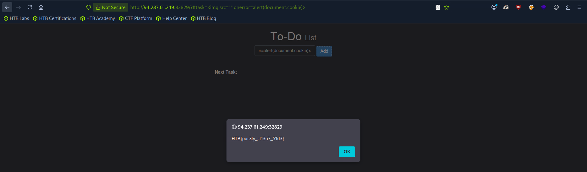

## DOM XSS

- Non Persistent XSS
- DOM XSS input data gets completely processed by the client side through JavaScript. Our input data never reaches the backend server for processing.
- Occurs when JavaScript is used to change page source through the Document Object Model (DOM).
- Non Persistent XSS so moving to a new page will remove the payload or effect.

### Source and Sink

- **Source** is the JavaScript object that takes the user input, it can be a URL parameter or any input field .etc.
- **Sink** is the function that writes the input data into the DOM Object on the webpage without sanitizing the input data.


## Commonly used DOM objects

- `document.write()`
- `DOM.innerHTML`
- `DOM.outerHTML`

## jQuery functions 

Below jQuery function help to write into DOM objects.

- `add()`
- `after()`
- `append()`

---

## Theory and Solutions

- To get the flag, use the same payload we used above, but change its JavaScript code to show the cookie instead of showing the url.
	- **HTB{redacted}**


This is DOM XSS Vulnerability which we can identify by analyzing the `script.js` code.

```js
document.getElementById("todo").innerHTML = "<b>Next Task:</b> " + decodeURIComponent(task);
```

`innerHTML` does not properly sanitize the input data so we can inject our XSS payload but we cannot include `<script>` tag because `innerHTML` does not allow that so we need to find another way. Below is our XSS payload.

```html

```

Paste this payload inside the **todo** input field and add it to get the flag value.




