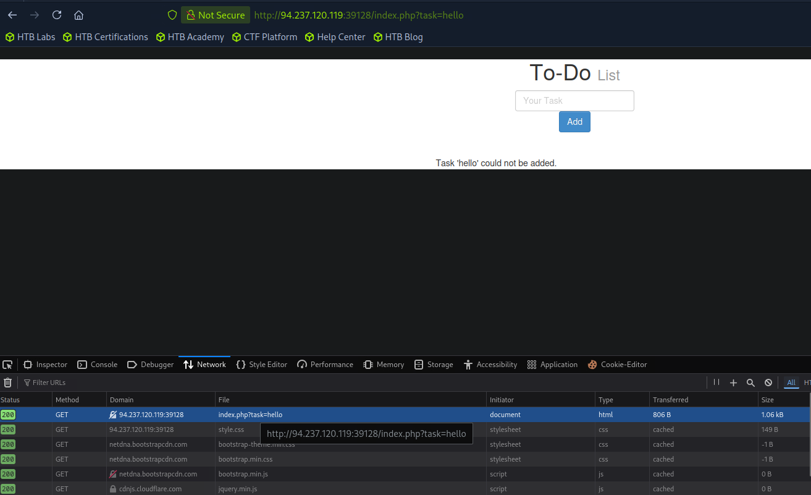
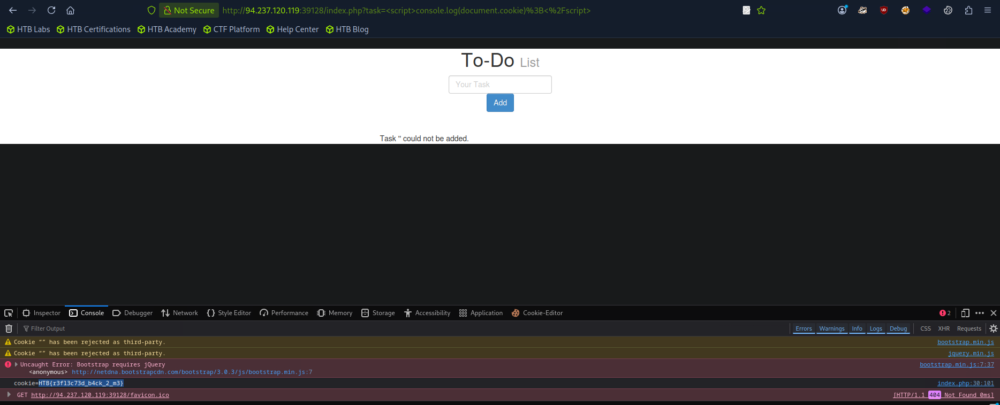

## Reflected XSS

- Non Persistent XSS i.e. vulnerability is temporary and it doesn't persist through page refreshes or if we move pages.
- Reflected XSS gets processed by the backend server.
- Only affects the targeted user and will not affect any other user visiting the page.
- Occurs when input reaches backend server and gets returned to us without being filtered or sanitized. If we move from one page to another, Reflected XSS payloads will not work since they are not persistent.

## How to Target if Non Persistent

- Depends which HTTP request is used to send our input to server.
- Go to Dev tools -> Network tab -> Check URL.
- Copy the URL and add the payload using `` to get the cookie value and get our flag. After entering the link go to the Console tab in the DevTools. You will also notice our task is showing `''` that's because our task is inside the `<script>` tag.

The URL looks different is because of URL encoding done by the web browser but we get our flag value.