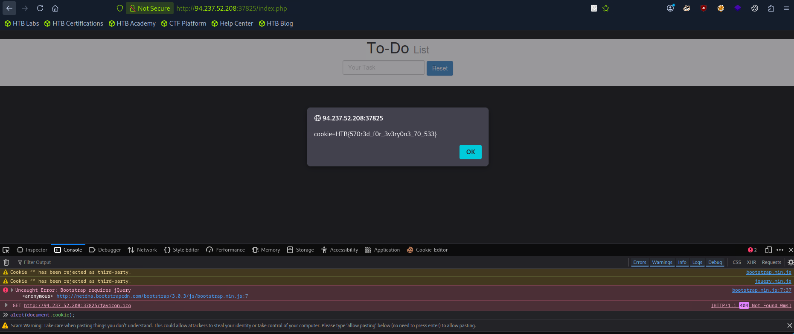

## Stored or Persistent XSS

- If our injected XSS payload gets stored in the backend database and retrieved upon visiting the page, this means our XSS attack is persistent and may affect any user who visits the page. 
- This makes this type of XSS the **most critical** as it affects a much wider audience. Furthermore, stored XSS may not be easily removable, and the payload might need removing from the backend database.

---
## Questions and Solutions

- To get the flag, use the same payload we used above, but change its JavaScript code to show the cookie instead of showing the url.
	- **HTB{redacted}**


Go to the target URL in the using any web browser. Open Dev Tools -> Go to Console tab. Then write the below code.

```js
alert(document.cookie);
```

The `document.cookie` can be used to get the value of the cookie.





