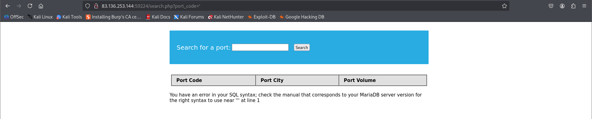
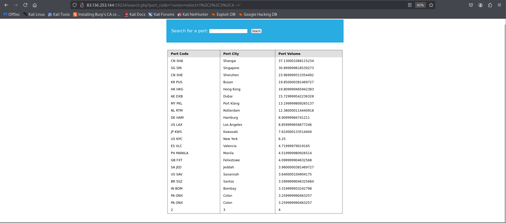
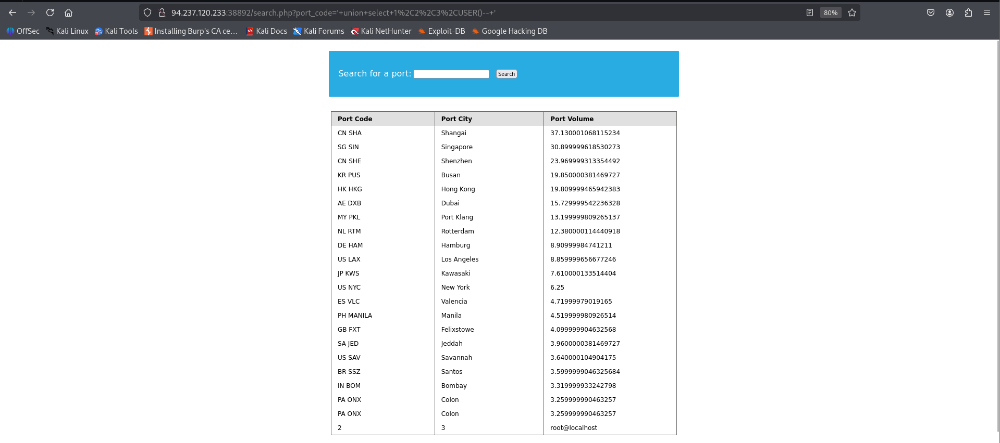

## Questions and Solutions

- Use a Union injection to get the result of 'user()'
	- **root@localhost**

I first went to the target web application and gave the below input to check whether SQL injection was possible or not. The input I gave in the input field was `'` and of course it does an SQL query on the input which resulted in an error.

#### Determining the number of columns

Since its confirmed its vulnerable to SQL injection we need to supply an appropriate payload to determine the number of columns. I at first supplied the payload `' UNION SELECT 1,2,3,4,5-- '` which returned an error meaning the number of columns are not matching since 5 doesn't exist so I dialed it down to 4.

Payload used -> `' UNION SELECT 1,2,3,4-- '`
But we only see 3 columns but the payload contains 4 which indicates that the first column is not displayed but it exists which may contain something related to **id** so maybe confidential and hence not displayed. We can conclude that out of column1, column2, column3 and column4, column2,3,4 are only displayed and that is why our **USER()** function needs to be in the place of any one of those respective columns.

I supplied the payload `' UNION SELECT 1,2,3,USER()-- '` . The **USER()** returns the current username and hostname for the SQL connection.

