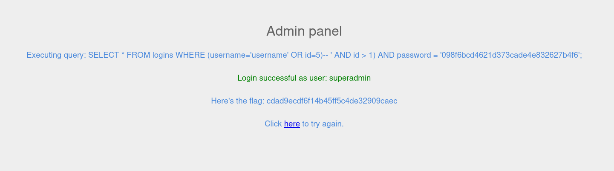

## Comments

- Comments are part of the code which are not executed.
- These comments as by the name suggests are used to write something about what the code does or basically comment something.
- Comments in SQL are written with `--` with space between the comments and the symbol. We can also use `#` symbol for one liner comment and `/**/` for multiline comments.

---
## Questions and Solutions

- Login as the user with the id 5 to get the flag.
	- **cdad9ecdf6f14b45ff5c4de32909caec**

Payload used by me `username' OR id=5)-- `  . Now let me explain the payload and why I used it.

1. **id=5** used because the question asks us to do so.
2. `username'` used because the starting `'` sign needs to be closed so ours.
3. `OR` operator used because we need to supply a random username which will obviously return false so the `OR` condition needs to be true, which it will be since there is someone with **id=5**.
4. Finally the `-- ` part which makes the rest of the part of the query a comment so useless basically and only our true condition with the `OR` operator is true so we will get our flag. **Remember: The space after `-- ` is necessary.**

