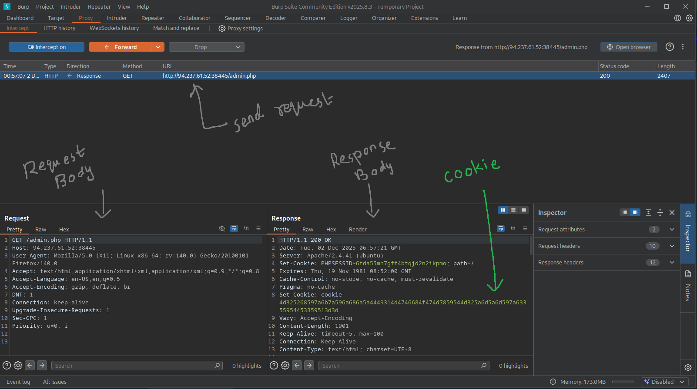
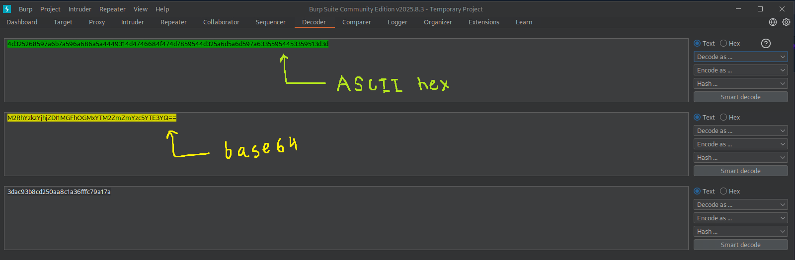
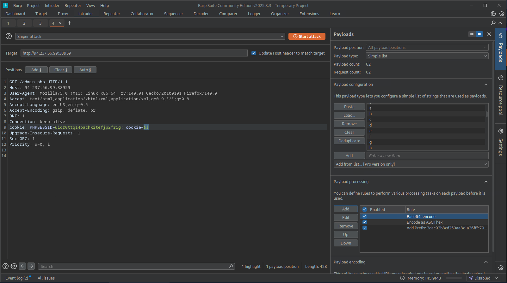
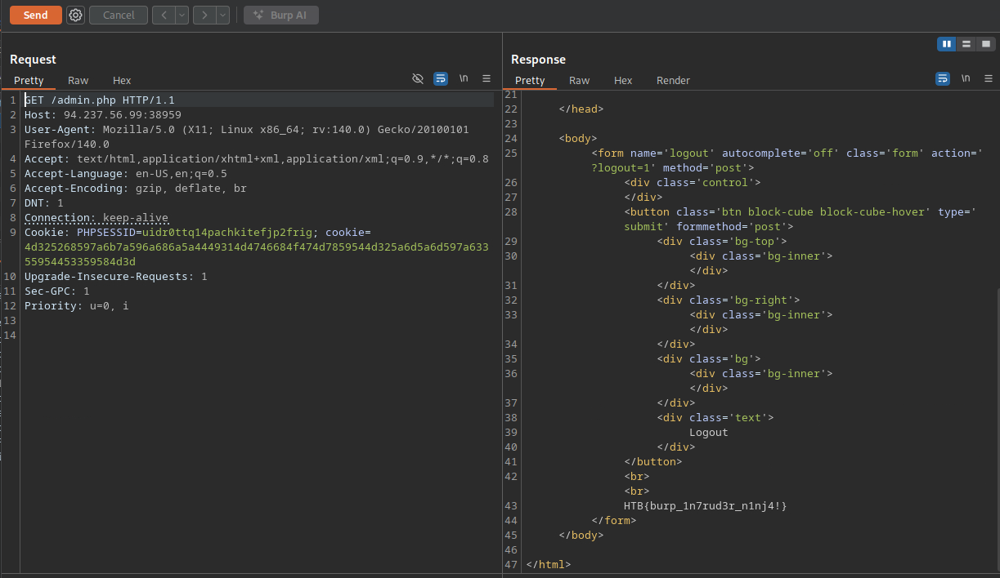
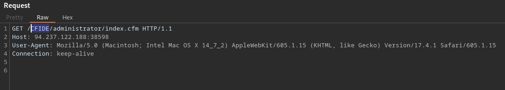

Remember ip will change because it takes quite sometime to finish the exercises.


- The /lucky.php page has a button that appears to be disabled. Try to enable the button, and then click it to get the flag.
	- **HTB{redacted}**


Before getting started ....
- Open BurpSuite.
- Go to Proxy -> Proxy settings
- Click Intercept Responses box (Responses Interception rules) area.

Turn on interceptor of BurpSuite and intercept the request made in `http://83.136.251.105:36289/lucky.php`. Forward the request and get the response. Now the response has a button which is **disabled**. We need to **enabled** it.

```html
<button class='btn block-cube block-cube-hover' id='submit' type='submit' formmethod='post' name='getflag' value='true' enabled>
```

After editing the above response we need to forward it. Now click the box inside the image.


After clicking the box we get a **POST** request intercepted in our BurpSuite proxy. 

```http
POST /lucky.php HTTP/1.1
Host: 83.136.251.105:36289
User-Agent: Mozilla/5.0 (X11; Linux x86_64; rv:140.0) Gecko/20100101 Firefox/140.0
Accept: text/html,application/xhtml+xml,application/xml;q=0.9,*/*;q=0.8
Accept-Language: en-US,en;q=0.5
Accept-Encoding: gzip, deflate, br
Referer: http://83.136.251.105:36289/lucky.php
Content-Type: application/x-www-form-urlencoded
Content-Length: 12
Origin: http://83.136.251.105:36289
DNT: 1
Connection: keep-alive
Upgrade-Insecure-Requests: 1
Sec-GPC: 1
Priority: u=0, i

getflag=true
```

**`getflag=true`** should be present in the **POST** request. Now send this request to repeater and keep sending the request multiple times. Look out for any change in Content-Length in the response. Any changes in Content-Length will indicate that the response has returned the flag.


- The /admin.php page uses a cookie that has been encoded multiple times. Try to decode the cookie until you get a value with 31-characters. Submit the value as the answer.
	- **3dac93b8cd250aa8c1a36fffc79a17a**


Send request at `http://94.237.61.52:38445/admin.php`. Check the below image to see the response.



Now lets start the decoding process. Go to the decoder tab and start decoding.




- Once you decode the cookie, you will notice that it is only 31 characters long, which appears to be an md5 hash missing its last character. So, try to fuzz the last character of the decoded md5 cookie with all alpha-numeric characters, while encoding each request with the encoding methods you identified above. (You may use the "alphanum-case.txt" wordlist from Seclist for the payload)
	- **HTB{redacted}**

Cookie value we got `3dac93b8cd250aa8c1a36fffc79a17a`. Now MD5 hash is 32 hexadecimal characters long but our cookie is only 31 characters so we 1 more. Now go to Intruder. We need to make a request to the `/admin.php` based on a couple of conditions. We need to add `/usr/share/wordlists/seclists/alphanum-case.txt` for our payload list. Add the decoded cookie value as suffix and encoded rules base64 and ASCII hex respectively.



Now start the Intruder. You will get many `200 OK` responses but only one response will have a bigger size. Send that request to Repeater and send the request and get the response within which the flag will be provided.




- You are using the 'auxiliary/scanner/http/coldfusion_locale_traversal' tool within Metasploit, but it is not working properly for you. You decide to capture the request sent by Metasploit so you can manually verify it and repeat it. Once you capture the request, what is the 'XXXXX' directory being called in '/XXXXX/administrator/..'?
	- **CFIDE**


We need to use metasploit's `auxiliary/scanner/http/coldfusion_locale_traversal` script. Below are configurations we need to make before running the script and remember to keep the BurpSuite interceptor ON.

```bash
use auxiliary/scanner/http/coldfusion_locale_traversal
set PROXIES http://127.0.0.1:8080
set RHOSTS 94.237.122.188
set RPORT 38598
run
```

Check the request body in BurpSuite to get the directory.



