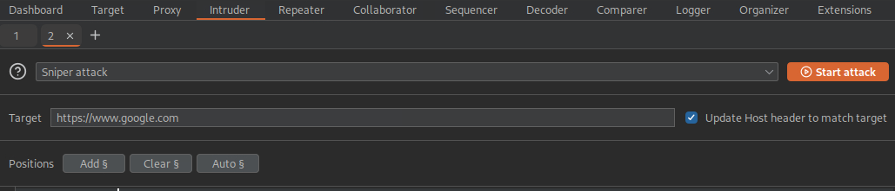
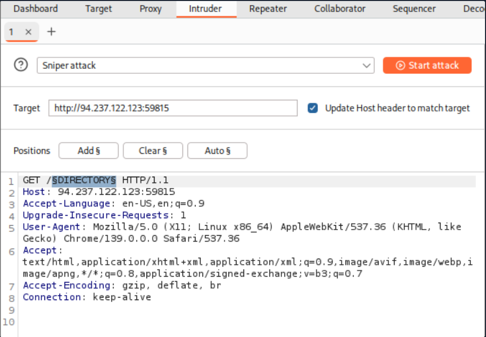
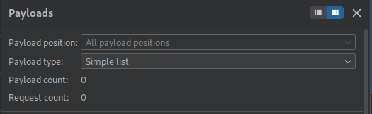
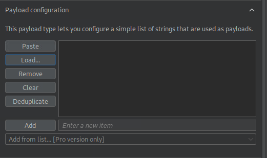
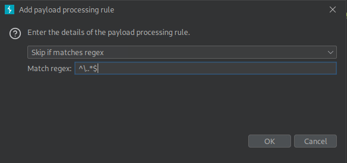
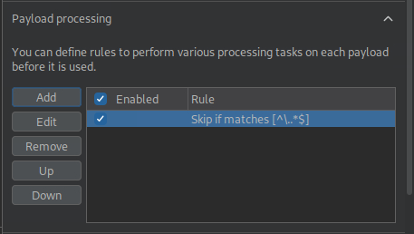
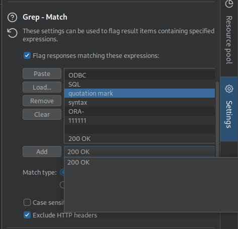

## Burp Intruder

- Intercept a request.
- Go to HTTP history.
- Right-Click on the particular request.
- Click send to Intruder in the drop down box.
- Go to Intruder Tab.

### Target

- Contains the target website ip/domain name.

### Positions

- This is where we place our payloads or words will be placed and iterated over.
- **Note: Be sure to leave the extra two lines at the end of the request, otherwise we may get an error response from the server.**

### Payloads

- This is where we customize our payloads.
- We can give our own custom wordlists and payloads in this section.
- There are four main things we need to configure:

	- Payload Position & Payload Type
	- Payload Configuration
	- Payload Processing
	- Payload Encoding

#### Payload Position and Payload Type

- Determines payload position and Payload type.

#### Payload Configuration

- We need to add or load our wordlist.

#### Payload Processing

- Allows us to determine fuzzing rules over the loaded wordlist.
- For example, if we wanted to add an extension after our payload item, or if we wanted to filter the wordlist based on specific criteria, we can do so with payload processing.
- **Click Add (to add a payload processing rule)**.

#### Settings

- Scroll down to **Grep - Match**
- Click **Flag responses matching these expressions**
	- Add -> 200 OK

#### Start

- After everything is setup **Click -> Start Attack**.

