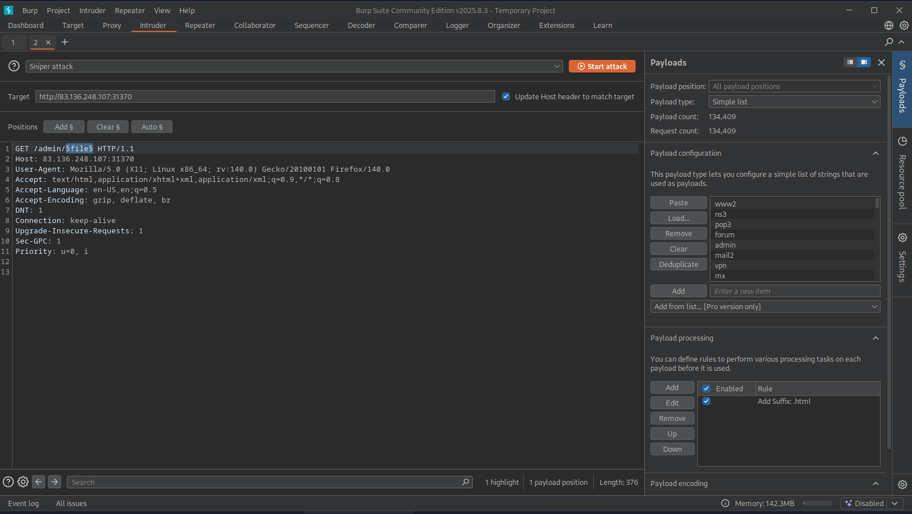

## Burp Intruder

Used for Web Penetration testing. Used to perform web fuzzing(finding web vulnerabilities), enumeration and bruteforcing. Can be used as an alternative for many CLI-based fuzzers, like `ffluf`, `dirbuster`, `gobuster`, `wfuzz` .etc.

- Intercept a request.
- Go to HTTP history.
- Right-Click on the particular request.
- Click send to Intruder in the drop down box.
- Go to Intruder Tab.
### Target

- Contains the target ip or domain name.
### Positions

- This is where we place our payloads or words will be placed and iterated over.
- **Note: Be sure to leave the extra two lines at the end of the request, otherwise we may get an error response from the server.**
### Payloads

This is where we customize our payloads.
- We can give our own custom wordlists and payloads in this section.
- There are four main things we need to configure:

	- Payload Position & Payload Type
	- Payload Configuration
	- Payload Processing
	- Payload Encoding


#### Payload Position and Payload Type

- Determines payload position and Payload type. 
- Types of List :
	- `Simple List`: The basic and most fundamental type. We provide a wordlist, and Intruder iterates over each line in it.
    
	- `Runtime file`: Similar to `Simple List`, but loads line-by-line as the scan runs to avoid excessive memory usage by Burp.
    
	- `Character Substitution`: Lets us specify a list of characters and their replacements, and Burp Intruder tries all potential permutations.

#### Payload Configuration

- We need to add or load our wordlist.

#### Payload Processing

- Allows us to determine fuzzing rules over the loaded wordlist.
- For example, if we wanted to add an extension after our payload item, or if we wanted to filter the wordlist based on specific criteria, we can do so with payload processing.
- **Click Ad-d (to add a payload processing rule)**.

#### Settings

- Scroll down to **Grep - Match**
- Click **Flag responses matching these expressions**
	- Add -> 200 OK

#### Start

- After everything is setup **Click -> Start Attack**.

---

## Questions and Solutions

- Use Burp Intruder to fuzz for '.html' files under the /admin directory, to find a file containing the flag.
	- **HTB{redacted}**


- Edited the Request body. Added `GET /admin/§1§ HTTP/1.1`. This is where the Payload or words will be appended.
- `/usr/share/wordlists/seclists/Discovery/Web-Content/common.txt` Wordlist is loaded.
- Added `.html` as suffix in Payload Processing.
- Started Attacking and only captured and displayed `200 OK` responses and rejected the rest.





We got the file. Now let's get our flag.

```bash
curl 83.136.248.107:31370/admin/2010.html
```

