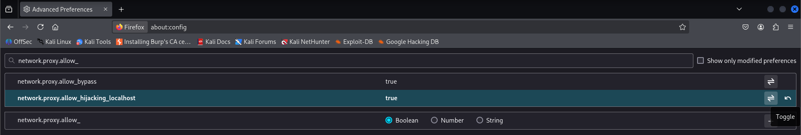

## Proxy Setup

- In many scenarios we would want to use the real web browser so in that case we need to configure our browser in such a way that it sends the traffic through Burpsuite and Burpsuite can intercept the HTTP/HTTPS traffic.

### Proxy Setup using FoxyProxy

- Add FoxyProxy extension for Firefox [FoxyProxy](https://addons.mozilla.org/en-US/firefox/addon/foxyproxy-standard/)
- Open FoxyProxy
- Go to Options
- Now do the below stuff

- Now choose your Proxy. Here its **Burp**.
- To check whether the proxy is working or not, Open the Burpsuite and turn on the Intercepter
- Then search any random stuff and you will see Burpsuite intercepts those requests. 

**NOTE: CA Certificate might be required so follow the below steps.**

## Installing CA Certificate

- This is required because with CA Certificate's absence the HTTPS traffic may not be properly routed.
- Burpsuite's inbuilt browser has CA Certificate configured so installation of CA Certificate is only required if you want to perform testing using the real default browser(external) NOT (internal) browser of Burpsuite.
- Start the **Burp** Proxy first using **FoxyProxy**.
- Go to `http://burpsuite`

- Click CA Certificate to download it.
- Go to Downloads -> then -> Import the CA Certificate to web browser(**cacert.der**).

- Open Web Browser -> Settings -> Privacy and Security -> Scroll down -> Certificates -> View Certificates -> Authorities -> Import (**Check the above 2 pics**)
- Check 2 boxes during Importing of the CA Certificate.

### Intercept localhost `127.0.0.1` Traffic

- Open Web Browser 
- Type `about:config` in search engine and press Enter
- Select Accept the Risks and Continue.
- Look for `network.proxy.allow_hijacking_localhost` in the Search Box.
- Set the value to `true`.
- Check the below pic.

