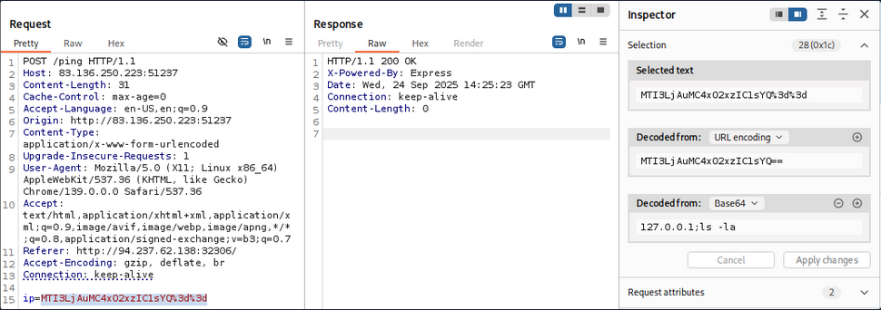

## Encoding/Decoding

- Go to Decoder tab
- Choose Decoder type 
- Paste the value of the encoding 
- You will see the output in the below box (**NOTE: You need to specify what is the format of decoding/encoding you need to perform on the value you pasted in the box.**)

- You can also use the Burp Inspector to do encoding/decoding operations. Check the below image.

