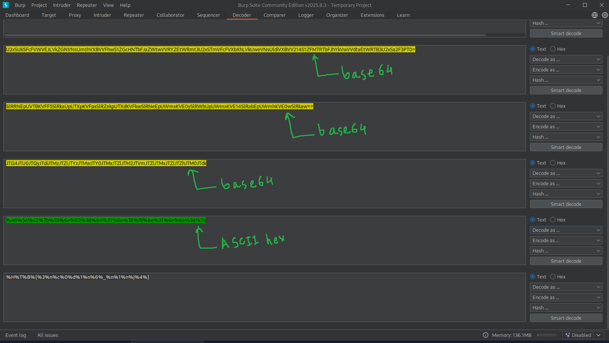

## Decoding

We will encounter various types of encodings in the HTTP requests so we need to be able to decode these encodings. BurpSuite can decode various types of encodings. Some of them are listed below.

- HTML
- Unicode
- Base64
- ASCII hex

Go to Decoder tab -> Choose Decode type and then paste the values.

**NOTE: You need to specify what is the format of decoding/encoding you need to perform on the value you pasted in the box.**

## Encoding/Decoding

- Checkout the Inspector tab inside the Repeater tab.
- Located beside the Response box.
- The Burp Inspector can be used for both encoding and decoding operations.

---
## Questions and Solutions

- The string found in the attached file has been encoded several times with various encoders. Try to use the decoding tools we discussed to decode it and get the flag.
	- **HTB{redacted}**

Download the **encoded_flag.zip** file and copy the encoded string into the BurpSuite decoder tab and assign it to the right encoded format and do the decoding and paste the decoded string.

