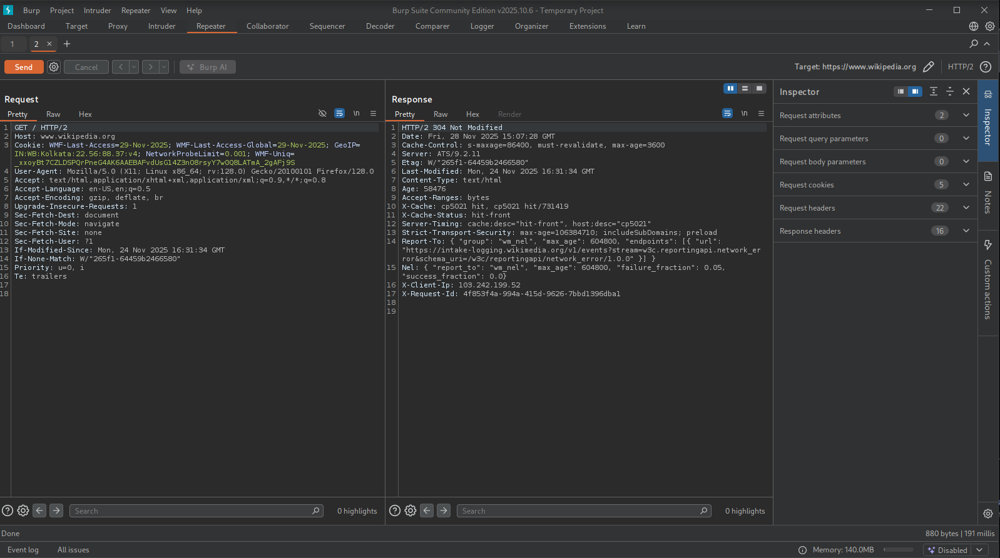

## BurpSuite Repeater

- Intercept a Request, then turn it off.
- Go to Proxy -> HTTP History -> Right-Click on a request -> Click Send to Repeater
- Open Repeater tab and make your own modifications
- You can send the request and see the response without explicitly visiting the web page

