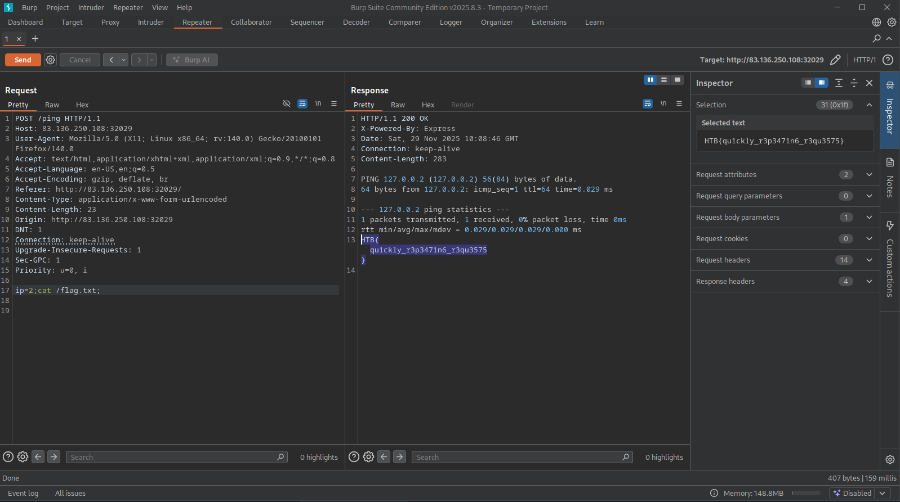

## BurpSuite Repeater

- Used to check and modify requests and responses without explicitly visiting the web page.

---

## Questions and Solutions

- Try using request repeating to be able to quickly test commands. With that, try looking for the other flag. **Hint : Its not in the same directory!**

First go to the target website and then turn on Intercepter and then go to HTTP history and send that request to the Repeater in BurpSuite and then send your desired commands in the **ip** variable like I have shown below.

