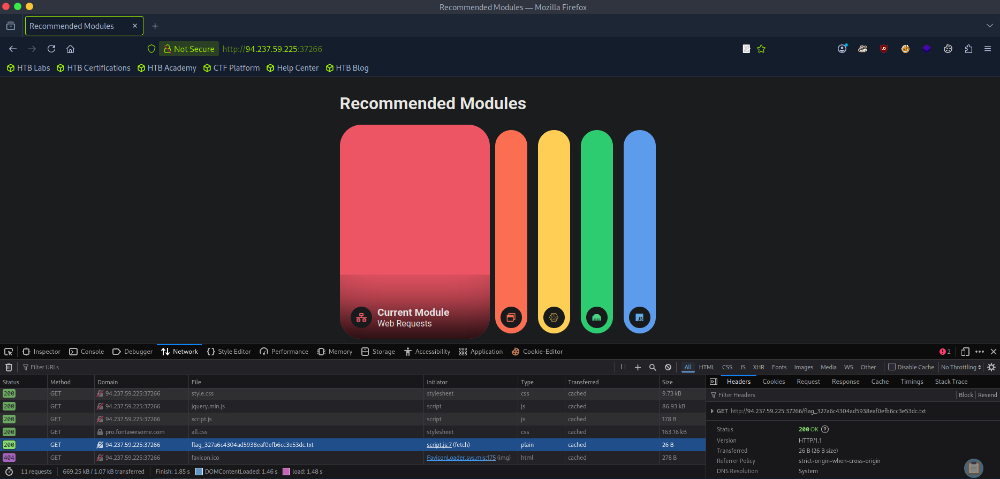

## HTTP Headers

- HTTP headers pass information between the client and server.
- Some headers are used with requests and some with responses.
- There are various types of Headers. They are :-
	- General Headers (Eg :- **Date**, **Connection** etc.)
	- Entity Headers (Eg :- **Content-Type**, **Content-Length** etc.)
	- Request Headers (Eg :- **Host**, **Cookie**, **Authorization**, **User-Agent**, **Referer**, etc.)
	- Response Headers (Eg :- **Server**, **Set-Cookie** etc.)
	- Security Headers (Eg :- **Strict Transport Policy**, **Content Security Policy**, **Referer Policy**)


---

## Questions and Solutions

- The server above loads the flag after the page is loaded. Use the Network tab in the browser devtools to see what requests are made by the page, and find the request to the flag.
	- **HTB{redacted}**




Check the GET request highlighted and go to that target location to get the flag or just use `curl`.

```bash
$ curl http://94.237.59.225:37266/flag_327a6c4304ad5938eaf0efb6cc3e53dc.txt
HTB{redacted}
```


