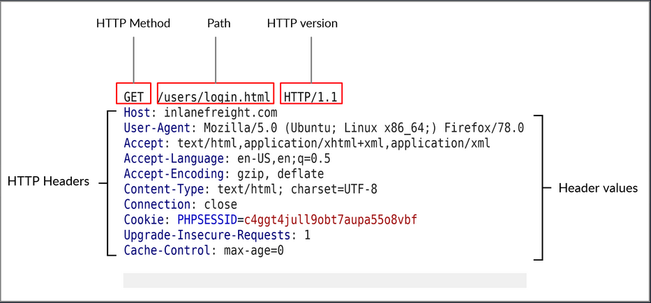

## HTTP Request


**URL** -> ``http://inlanefreight.com/users/login.html``

The first line of any HTTP request contains three main fields 'separated by spaces':

| **Field** | **Example**         | **Description**                                                                                                       |
| --------- | ------------------- | --------------------------------------------------------------------------------------------------------------------- |
| `Method`  | `GET`               | The HTTP method or verb, which specifies the type of action to perform.                                               |
| `Path`    | `/users/login.html` | The path to the resource being accessed. This field can also be suffixed with a query string (e.g. `?username=user`). |
| `Version` | `HTTP/1.1`          | The third and final field is used to denote the HTTP version.                                                         |




## HTTP Response

Once the server processes our request, it sends its response. The following is an example HTTP response:


## View Request and Response

```bash
curl google.com -v
```

- The `-v` switch used to display the request from client and response from server along with the headers in detail.


---

## Questions and Solutions

- What is the HTTP method used while intercepting the request? (case-sensitive)
	- **GET**

- Send a GET request to the above server, and read the response headers to find the version of Apache running on the server, then submit it as the answer. (answer format: X.Y.ZZ)
	- **2.4.41**


```bash
$ curl 94.237.58.98:49765 -v
*   Trying 94.237.58.98:49765...
* Connected to 94.237.58.98 (94.237.58.98) port 49765 (#0)
> GET / HTTP/1.1
> Host: 94.237.58.98:49765
> User-Agent: curl/7.88.1
> Accept: */*
> 
< HTTP/1.1 200 OK
< Date: Mon, 17 Nov 2025 17:55:11 GMT
< Server: Apache/2.4.41 (Ubuntu)
< Vary: Accept-Encoding
< Content-Length: 348
< Content-Type: text/html; charset=UTF-8
< 
<!DOCTYPE html>
<html lang="en">

<head>
    <meta charset="UTF-8">
    <meta http-equiv="X-UA-Compatible" content="IE=edge">
    <meta name="viewport" content="width=device-width, initial-scale=1.0">
    <title>Blank Page</title>
</head>

<body>
    This page is intentionally left blank.
    <br>
    Using cURL should be enough.
</body>

* Connection #0 to host 94.237.58.98 left intact
```

